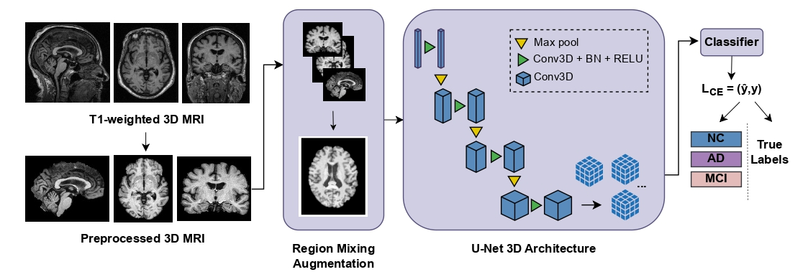
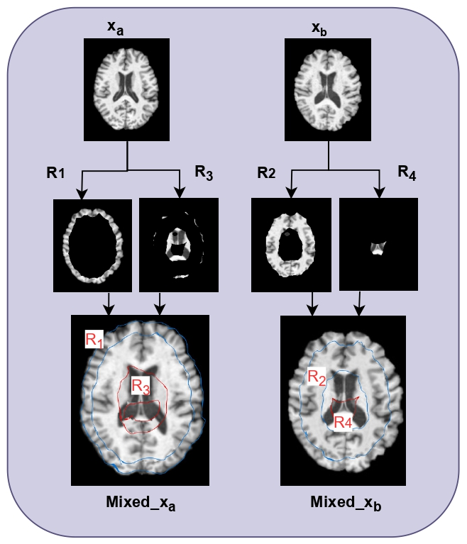

# Distance Transform Guided Mixup for Alzheimer's Disease Classification

Accepted at **IEEE SIU 2025**

## Paper

- IEEE Xplore: https://ieeexplore.ieee.org/abstract/document/11112112

---

## Overview

Deep learning models for Alzheimer’s disease classification from structural MRI often suffer from poor generalization across datasets due to domain shifts caused by scanner differences, acquisition protocols, and demographic variability.

This work proposes a **Distance Transform Guided Mixup** strategy for **single-domain generalization (SDG)** in Alzheimer's disease classification. Instead of performing random image interpolation, the proposed approach computes distance transforms of MRI scans and performs region-aware mixing between samples while preserving anatomical structure.

The model is trained on the **NACC** dataset and evaluated on unseen **ADNI** and **AIBL** datasets.

---

## Proposed Pipeline

<p align="center">
  
</p>

---

## Region Mixing Strategy

<p align="center">
  
</p>

Given two MRI scans, distance-transform-based masks are used to divide the brain into multiple non-overlapping regions. Regions from different samples are then spatially combined to generate anatomically meaningful augmented images while preserving structural integrity.

---

## Key Contributions

- Novel distance-transform-guided mixup augmentation for Alzheimer's disease classification
- Structure-aware region mixing instead of random interpolation
- Improved robustness under single-domain generalization settings
- Cross-dataset evaluation on unseen MRI cohorts
- Plug-and-play augmentation strategy adaptable to other neurodegenerative diseases

---

## Repository Structure

```text
project/
│
├── notebook/
│   └── Distance_Transform.ipynb
│
├── src/
│   ├── imports.py
│   ├── unet3d.py
│   ├── classifier.py
│   ├── utilities.py
│   ├── data_processing.py
│   ├── data_loading.py
│   ├── lightning_module.py
│   └── train.py
│
├── figures/
│   ├── main_pipeline.png
│   ├── region_mixing.png
└── README.md
```

---

## Important Note

Both:
- Jupyter Notebook implementation
- Modular VS Code / Python project implementation

are provided in this repository.

For easier reproduction and experimentation, the **notebook version is recommended**.  
The modular Python project version is included for cleaner project organization and future development.

---

## Installation

Clone the repository:

```bash
git clone https://github.com/your_username/your_repo.git
cd your_repo
```

Create environment:

```bash
conda create -n ad_mixup python=3.10
conda activate ad_mixup
```

Install dependencies:

```bash
pip install -r requirements.txt
```

---

## Training

Run training:

```bash
python train.py
```

Or use the notebook version:

```text
notebook/Distance_Transform.ipynb
```

---

## Citation

If you find this work useful, please cite:

```bibtex
@inproceedings{batool2025distance,
  title={Distance Transform Guided Mixup for Alzheimer’s Detection},
  author={Batool, Zobia and Ozkan, Huseyin and Aptoula, Erchan},
  booktitle={IEEE SIU},
  year={2025}
}
```

---

## Disclaimer

This repository is intended for research purposes only and is not designed for clinical use.

---

## Contact

For questions, collaborations, or implementation details:

**Zobia Batool**  
zobia.batool@sabanciuniv.edu
